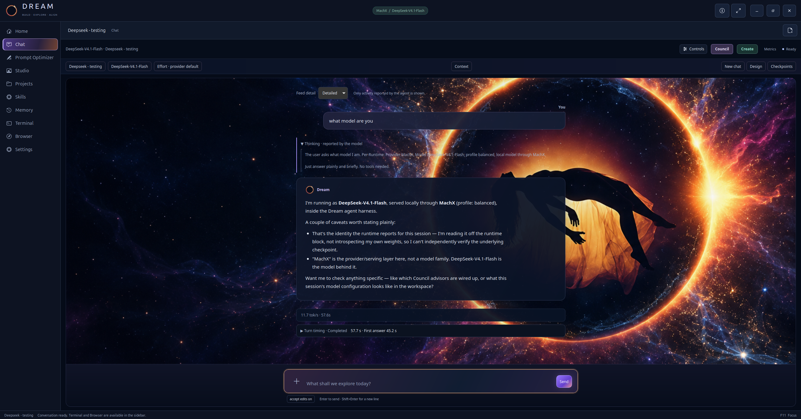

# Dream

**Your models. Your workspace.**

Dream is a multi-model agent harness for coding, research, writing, and creative
work. Use a hosted agent or a compatible local model in one workspace, with a
terminal, streaming chat, browser, Studio previews, tools, and optional memory.



<sub>Dream running DeepSeek-V4.1-Flash locally through the [MachX inference engine](https://github.com/Red-Weasel/machx-inference-engine) on two Intel Arc Pro B70 cards — reasoning shown, 11.7 tok/s.</sub>

## What you can do

- **Choose your main agent.** Connect Claude through the Agent SDK, authenticated
  Codex/Grok/Gemini CLIs, or an OpenAI-compatible HTTP endpoint. MachX integration
  supports local model discovery and loading when that engine is installed.
- **Keep control in view.** See the selected workspace, model, supported reasoning
  effort, permission mode, tool activity, and failures. Adjust supported effort
  between requests; exact controls depend on the adapter.
- **Correct an active HTTP chat.** Steer saves a correction for the next lead
  request after the current tool batch finishes. Queue remains a separate action;
  native adapters and autonomous workflows retain explicit queued behavior.
- **Prepare a clearer prompt.** Open Prompt Optimizer beside Chat, add your goal
  and files, answer material questions, then edit the structured draft. Quick
  structure works without inference; using a draft never sends it automatically.
  Native desktop navigation includes the same editor.
  [Prompt Optimizer guide](docs/public/prompt-optimizer.md).
- **Work in Chat and Studio.** Inspect generated pages and supported local media,
  expand the preview, compare preserved source revisions, and browse registered
  outputs. Native Terminal and Browser remain available alongside the workspace.
- **Bring in another model.** Council offers named model selections, per-member
  effort, read-only reviews, active editing assignments, and sequential team relay.
  Editing members take turns and return control to the main agent.
- **Organize ongoing projects.** Return to saved workspaces, conversations,
  instructions, documents, and project memory. Continue with saved context or
  start a new chat; project switches wait for an idle session. Draft a sourced
  handoff, review it in the Markdown editor, and save it without a model call.
- **Make skills your own.** Read full instructions, edit private versions, and
  create new reusable skills in the Skills page. Computer-use and Blender workflows
  provide focused procedures; recorded drafts can include reviewed frame-linked evidence.
- **Act through shared computer tools.** Open a separate controlled browser tab or
  attach an explicit X11 window. Observe current state, act once, and inspect the
  result. Desktop control requires X11/xdotool; Wayland control is unavailable.
- **Resume with context.** Sessions, project pins, durable run records, and optional
  Markdown-backed memory help carry work forward. Memory write tools save before
  optional embedding work. Closing distinguishes saved conversations from optional
  model consolidation.
- **Extend the toolkit.** Use curated workflows, MCP integrations, and reviewed
  custom tools. Vision requires an image-capable model and a compatible adapter;
  an image path alone is not visual evidence.

## Get started

The source installation uses **Python 3.12+** and **uv**. The native desktop targets
Linux with GTK, VTE, and WebKitGTK; the CLI does not require that desktop stack.

```bash
git clone https://github.com/Red-Weasel/Dream-Agent-Harness.git
cd Dream-Agent-Harness
uv sync --locked --extra dev

# Terminal model/provider picker
uv run --locked dream

# Graphical workspace chooser
uv run --locked dream desktop
```

Choose your project folder explicitly when starting a session. To select a
provider from the command line:

```bash
uv run --locked dream --provider codex --workspace /path/to/project
uv run --locked dream --provider anthropic --workspace /path/to/project
```

Provider software, authentication, subscription eligibility, and API charges are
separate from Dream. Models and credentials are not included. See
[installation and provider setup](docs/public/getting-started.md).

### Local models with the MachX engine

[MachX](https://github.com/Red-Weasel/machx-inference-engine) is the companion
inference engine for Intel Arc GPUs (oneAPI 2026.x). Dream looks for it at
`~/machx-inference-engine`, so cloning both repositories into your home directory
needs no configuration:

```bash
cd ~
git clone https://github.com/Red-Weasel/machx-inference-engine.git
cd machx-inference-engine
source scripts/env.sh
cmake -S . -B build -G Ninja && cmake --build build -j

cd ~/Dream-Agent-Harness
uv run --locked dream local        # or pick MachX in `dream desktop`
```

Dream starts and stops `ie serve` itself (model picker, GPUs, context). For an engine
checkout elsewhere, set `DREAM_MACHX_DIR=/path/to/machx-inference-engine`. Model files
are not included; see the engine's README for supported models and their memory needs.

## The workspace

Dream uses midnight navy, violet controls, and an orange eclipse identity. Home
returns you to the selected workspace; Chat keeps the conversation readable;
Studio holds artifacts and previews. The context inspector displays reported
runtime facts and marks unavailable information explicitly.
[Projects, documents, memory, and skill editing](docs/public/projects-and-skills.md).

| Control | Action |
|---|---|
| Ctrl+K in the web workspace | Open the destination palette |
| Shift+Tab in the Chat composer | Cycle Ask, Accept edits, Auto, and Plan |
| Shift+Enter | Add a line to the message |
| Stop | Interrupt the current turn |
| Studio → Expand | Enlarge the existing preview |
| Council | Choose main/member models, effort, review, or editing assignments |

Chat follows new activity until you scroll back to read history. Returning to the
bottom resumes following. Classic presentation is available without discarding
the current draft.

The primary navigation stays in one place. **Context** offers saved workspace
spacing, collapsed artwork banners and quiet mode. Projects and Skills support
sorting, filtering and keyboard browsing. On narrow windows, **Tools** holds the
remaining workspace actions. [Computer controls](docs/public/computer-controls.md)
and [teaching skills](docs/public/teaching-skills.md) describe their boundaries.

## Automation with explicit boundaries

Auto mode lets eligible work proceed under the active execution policy. Native
Bash offers session-scoped **Always allow** choices for eligible exact commands,
with separate sandbox and host grants. Consequential actions and invalid scopes
remain gated; provider-owned executors may have their own approval controls.

Active and wall-clock runtime limits are optional. Local HTTP generation has no
read cutoff by default; an explicit `DREAM_LLM_READ_TIMEOUT_S` can impose one.
Stop remains available. A lost connection does not prove the server stopped:
check an uncertain request before confirming idle, and inspect saved work before
retrying. [Runtime and recovery guide](docs/public/runtime.md).

Controls reports the process version and selected source changes since startup.
Turn timing separates reported tool errors, successes and unknown outcomes.
Read-loop guidance recognizes repeated unchanged observations even when paging
arguments vary. Scheduled HTTP output reviews report findings or unavailable
inspection as incomplete. Failed delivery cannot be hidden by a completion claim;
visual PASS requires executed inspection and submitted image evidence. Decoded
media and a verifier pass still do not establish
visual quality or owner acceptance. [Progress and delivery checks](docs/public/progress-and-delivery.md).

## Your data stays out of this source release

This source tree includes the harness, bundled assets, curated skills, tests, and
synthetic evaluation fixtures. It does not distribute a user's memory database,
session transcripts, personal instructions, logs, credentials, model weights, or
workspace deliverables. New installations create their own runtime state.

Dream can send prompts, context, files, and tool results to the provider you select.
“Stored locally” does not mean “never sent to a model.” Review your provider and
extension choices. Keep runtime backups private and inspect outgoing Git content;
`.gitignore` does not remove files already committed or erase Git history.
[Data and privacy guide](docs/public/privacy.md).

## Current limits

- Council editing is sequential; simultaneous isolated editing agents are not yet
  implemented.
- Optional model-generated memory consolidation can still take minutes. Deferred
  vector indexing uses the existing backfill lifecycle; keyword recall is immediate.
- Registered media history is not a complete version archive of arbitrary files.
- Model quality, speed, vision, reasoning, and cancellation support vary by provider.
- Blender, rendering devices, headless graphics, browser codecs, and FFmpeg need
  their own installation and capability checks. Missing NVIDIA tooling does not
  establish that no GPU is available.

The latest local CPU qualification passed **5,179 tests**, with **45 skipped**,
one owner-memory-dependent test deselected, and **7 warnings**. A clean locked
installation and wheel privacy/layout checks also passed. Separate software
GTK/WebKit fixtures checked video playback, reconnect, Stop and Prompt Optimizer
drafts. These are scoped engineering checks, not a claim of universal model
compatibility or benchmark superiority.
[Development and validation](docs/public/development.md).

## Support

☕ **Buy me a coffee.** -- Unemployed and extremely grateful for any support -- If Dream is useful to you, donations are welcome, one-time or monthly. All donations support the project.

[](https://ko-fi.com/redweasel)

**[ko-fi.com/redweasel](https://ko-fi.com/redweasel)**

## License

Apache-2.0 — see [LICENSE](LICENSE).
