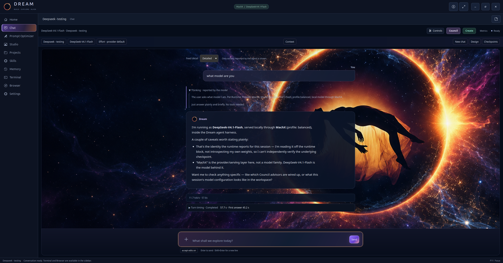
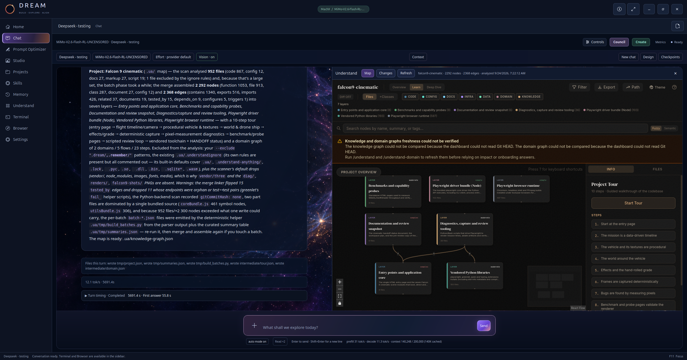

# Dream

**Your models. Your workspace.**

Dream is a multi-model agent harness for coding, research, writing, and creative
work. Use a hosted agent or a compatible local model in one workspace, with a
terminal, streaming chat, browser, Studio previews, tools, and optional memory.



<sub>Dream running DeepSeek-V4.1-Flash locally through the [MachX inference engine](https://github.com/Red-Weasel/machx-inference-engine) on two Intel Arc Pro B70 cards — reasoning shown, 11.7 tok/s.</sub>


<sub>Dream mapping a 952-file project with the Understand-Anything skill, run locally on MiMo-V2.6-Flash through MachX — 2,292 nodes and 2,368 edges in seven layers, a guided tour and a domain graph, shown in the Understand dock beside the chat.</sub>

## What you can do

- **Choose your main agent.** Connect Claude through the Agent SDK, authenticated
  Codex/Grok/Gemini CLIs, or an OpenAI-compatible HTTP endpoint. MachX integration
  supports local model discovery and loading when that engine is installed.
- **Keep control in view.** See the selected workspace, model, supported reasoning
  effort, permission mode, tool activity, and failures. Adjust supported effort
  between requests; exact controls depend on the adapter.
- **Correct an active HTTP chat.** Steer saves a correction for the next lead
  request after the current tool batch finishes. Queue remains a separate action;
  native adapters and autonomous workflows retain explicit queued behavior.
- **Prepare a clearer prompt.** Open Prompt Optimizer beside Chat, add your goal
  and files, answer material questions, then edit the structured draft. Quick
  structure works without inference; using a draft never sends it automatically.
  Native desktop navigation includes the same editor.
  [Prompt Optimizer guide](docs/public/prompt-optimizer.md).
- **Work in Chat and Studio.** Inspect generated pages and supported local media,
  expand the preview, compare preserved source revisions, and browse registered
  outputs. Native Terminal and Browser remain available alongside the workspace.
- **Bring in another model.** Council offers named model selections, per-member
  effort, read-only reviews, active editing assignments, and sequential team relay.
  Editing members take turns and return control to the main agent.
- **Organize ongoing projects.** Return to saved workspaces, conversations,
  instructions, documents, and project memory. Continue with saved context or
  start a new chat; project switches wait for an idle session. Draft a sourced
  handoff, review it in the Markdown editor, and save it without a model call.
- **Make skills your own.** Read full instructions, edit private versions, and
  create new reusable skills in the Skills page. Computer-use and Blender workflows
  provide focused procedures; recorded drafts can include reviewed frame-linked evidence.
- **Act through shared computer tools.** Open a separate controlled browser tab or
  attach an explicit X11 window. Observe current state, act once, and inspect the
  result. Desktop control requires X11/xdotool; Wayland control is unavailable.
- **Resume with context.** Sessions, project pins, durable run records, and optional
  Markdown-backed memory help carry work forward. Memory write tools save before
  optional embedding work. Closing distinguishes saved conversations from optional
  model consolidation.
- **Extend the toolkit.** Use curated workflows, MCP integrations, and reviewed
  custom tools. Vision requires an image-capable model and a compatible adapter;
  an image path alone is not visual evidence.

## What's new in v0.2.0

- **Nested Dream.** A new sidebar tab shows one session as the main agent and its
  sub-agents: the main agent's conversation, goal and plan on one side, and one
  card per worker on the other, with its model, context use, tool calls and text
  as it streams. Pause, resume, stop or message a single worker; **Pause all**
  holds every worker Dream runs. Permission requests collect in a **Needs you**
  list, and **All agents** opens every worker's retained transcript.
  **Agents 4 / 8 / 12 / 16** sets how many agents one reply may run, the main
  agent included (8 by default). The tab runs nothing of its own: it is rebuilt
  from the session's events, so a reload shows the same page.
- **Sub-agents decode together on a local engine.** When MachX serves a model in
  lanes, the `task` calls of one reply run at the same time, up to the lane
  count, and the rest queue. `engine.parallel` (1 to 16) and `engine.slot_ctx`
  set the lanes for MiMo-V2.6, DeepSeek-V4.1, Qwen3.8-Flash, the 35B-A3B class
  and Qwen3.8-27B. The default stays one lane. Each extra lane reserves VRAM,
  and a load that does not fit is refused before anything runs.
- **Claude-led sessions in Nested.** The sub-agents a Claude session runs appear
  as read-only cards. With a local engine running, Claude can also hand sub-tasks
  to the local model through `delegate_local`: those helpers are full cards with
  Stop, Pause and Message, and their usage is metered separately.
- **Settings in one view.** `dream settings`, `/settings` and **Controls →
  Settings** list every setting with its value and its source (environment,
  session, project, saved or default). Roles choose the model for sub-agents, the
  verifier, the filer, the critic, the evaluator and the reviewer. A project may
  carry `.dream/settings.json`. A refused value names its key and writes nothing;
  an unusable settings file is reported and never rewritten.
- **Context management.** Four settings decide what happens as a context fills.
  The main agent compacts, writes a Handoff and carries on, or stops with a
  summary. A sub-agent returns its report so far, continues in a fresh context,
  or compacts. One trigger (80% by default) applies to every window size, and
  the model is warned before it. Fresh start is now called **Handoff**.
- **Understand.** The Understand panel is a sidebar switch that sits beside Chat
  or Nested Dream. The skill maps a project once, then re-analyses only the files
  that changed, and runs its scripts in Dream's sandbox like any other skill.
- **Security hardening.** The model's `browse` tool and the controlled browser
  reach only the public internet: loopback, private and link-local destinations
  are refused before any connection, and page content returns marked as untrusted
  data. `browse` opens a local address only when you typed that URL yourself, and
  then sealed off from the internet. On Linux the browsing browser runs under
  bubblewrap in its own network namespace, with no unsandboxed fallback. The
  computer tool refuses Dream's own windows, treats terminals as view-only and
  re-checks its target before every input. The Studio server checks each
  request's host and origin, and desktop web content runs sandboxed.
- **Sleepwalk automations.** Written instructions run on a schedule with a
  read-only, isolated runner and keep every result. Optional connectors read
  Gmail and Google Calendar and notify through email or Telegram; background runs
  use a systemd user timer. See the [Sleepwalk guide](dream/sleepwalk/README.md).
- **Skill presets and domain skills.** The Skills page is a three-column
  workspace. A preset chooses which skills, plugins, MCP servers and tool groups
  a new session loads. Seven built-in presets draw on 34 new domain skills.
- **Lucid Control and response styles.** Lucid Control replaces the Memory tab:
  your instructions, the project's `DREAM.md` and `PLAN.md`, the memories and the
  response style, edited in place with version-checked saves.
- **Local model loading.** The load screen offers each model's recommended
  sampling per mode. Dream can front several models on one endpoint through the
  engine's supervisor, and gives the engine 120 seconds to stop in order.
- **Install.** `uv sync --locked --extra dev` works in a fresh clone again, and
  every place Dream reports its version reads one value.

Known limits of this release:

- On a local engine each sub-agent has its own, smaller context: the engine's
  lane size, 32,768 tokens by default (`engine.slot_ctx` changes it). Its card
  shows the main agent's window instead, so the card understates how full the
  worker is.
- A worker that uses its whole reply budget while thinking returns no output.
  Its card ends as **Outcome unknown**; ask the main agent to run it again.
- **Stop** on a worker is not instant on a local engine: the engine is asked to
  stop that worker at its next round boundary.
- The Understand skill maps with one agent in this release. It does not spread
  the analysis over sub-agents.
- Workers share the session's one workspace, so parallel coders need disjoint
  files. The coding CLIs report no worker activity, and the **Workflows** tab in
  Nested Dream is an empty state.

## Get started

The source installation uses **Python 3.12+** and **uv**. The native desktop targets
Linux with GTK, VTE, and WebKitGTK; the CLI does not require that desktop stack.

```bash
git clone https://github.com/Red-Weasel/Dream-Agent-Harness.git
cd Dream-Agent-Harness
uv sync --locked --extra dev

# Terminal model/provider picker
uv run --locked dream

# Graphical workspace chooser
uv run --locked dream desktop
```

Choose your project folder explicitly when starting a session. To select a
provider from the command line:

```bash
uv run --locked dream --provider codex --workspace /path/to/project
uv run --locked dream --provider anthropic --workspace /path/to/project
```

Provider software, authentication, subscription eligibility, and API charges are
separate from Dream. Models and credentials are not included. See
[installation and provider setup](docs/public/getting-started.md).

### Local models with the MachX engine

[MachX](https://github.com/Red-Weasel/machx-inference-engine) is the companion
inference engine for Intel Arc GPUs (oneAPI 2026.x). Dream looks for it at
`~/machx-inference-engine`, so cloning both repositories into your home directory
needs no configuration:

```bash
cd ~
git clone https://github.com/Red-Weasel/machx-inference-engine.git
cd machx-inference-engine
source scripts/env.sh
cmake -S . -B build -G Ninja && cmake --build build -j

cd ~/Dream-Agent-Harness
uv run --locked dream local        # or pick MachX in `dream desktop`
```

Dream starts and stops `ie serve` itself (model picker, GPUs, context). For an engine
checkout elsewhere, set `DREAM_MACHX_DIR=/path/to/machx-inference-engine`. Model files
are not included; see the engine's README for supported models and their memory needs.

The matching engine release for Dream v0.2.0 is **MachX v0.2.6**. Sub-agents
decode together through the engine's lanes: `dream settings set engine.parallel 4`
asks for four, from the next time Dream starts the engine.

## The workspace

Dream uses midnight navy, violet controls, and an orange eclipse identity. Home
returns you to the selected workspace; Chat keeps the conversation readable;
Studio holds artifacts and previews. The context inspector displays reported
runtime facts and marks unavailable information explicitly.
[Projects, documents, memory, and skill editing](docs/public/projects-and-skills.md).

| Control | Action |
|---|---|
| Ctrl+K in the web workspace | Open the destination palette |
| Shift+Tab in the Chat composer | Cycle Ask, Accept edits, Auto, and Plan |
| Shift+Enter | Add a line to the message |
| Stop | Interrupt the current turn |
| Studio → Expand | Enlarge the existing preview |
| Council | Choose main/member models, effort, review, or editing assignments |

Chat follows new activity until you scroll back to read history. Returning to the
bottom resumes following. Classic presentation is available without discarding
the current draft.

The primary navigation stays in one place. **Context** offers saved workspace
spacing, collapsed artwork banners and quiet mode. Projects and Skills support
sorting, filtering and keyboard browsing. On narrow windows, **Tools** holds the
remaining workspace actions. [Computer controls](docs/public/computer-controls.md)
and [teaching skills](docs/public/teaching-skills.md) describe their boundaries.

## Automation with explicit boundaries

Auto mode lets eligible work proceed under the active execution policy. Native
Bash offers session-scoped **Always allow** choices for eligible exact commands,
with separate sandbox and host grants. Consequential actions and invalid scopes
remain gated; provider-owned executors may have their own approval controls.

Active and wall-clock runtime limits are optional. Local HTTP generation has no
read cutoff by default; an explicit `DREAM_LLM_READ_TIMEOUT_S` can impose one.
Stop remains available. A lost connection does not prove the server stopped:
check an uncertain request before confirming idle, and inspect saved work before
retrying. [Runtime and recovery guide](docs/public/runtime.md).

Controls reports the process version and selected source changes since startup.
Turn timing separates reported tool errors, successes and unknown outcomes.
Read-loop guidance recognizes repeated unchanged observations even when paging
arguments vary. Scheduled HTTP output reviews report findings or unavailable
inspection as incomplete. Failed delivery cannot be hidden by a completion claim;
visual PASS requires executed inspection and submitted image evidence. Decoded
media and a verifier pass still do not establish
visual quality or owner acceptance. [Progress and delivery checks](docs/public/progress-and-delivery.md).

## Your data stays out of this source release

This source tree includes the harness, bundled assets, curated skills, tests, and
synthetic evaluation fixtures. It does not distribute a user's memory database,
session transcripts, personal instructions, logs, credentials, model weights, or
workspace deliverables. New installations create their own runtime state.

Dream can send prompts, context, files, and tool results to the provider you select.
“Stored locally” does not mean “never sent to a model.” Review your provider and
extension choices. Keep runtime backups private and inspect outgoing Git content;
`.gitignore` does not remove files already committed or erase Git history.
[Data and privacy guide](docs/public/privacy.md).

## Current limits

- Council editing is sequential; simultaneous isolated editing agents are not yet
  implemented.
- Optional model-generated memory consolidation can still take minutes. Deferred
  vector indexing uses the existing backfill lifecycle; keyword recall is immediate.
- Registered media history is not a complete version archive of arbitrary files.
- Model quality, speed, vision, reasoning, and cancellation support vary by provider.
- Blender, rendering devices, headless graphics, browser codecs, and FFmpeg need
  their own installation and capability checks. Missing NVIDIA tooling does not
  establish that no GPU is available.

The latest local CPU qualification of this tree (October 2, 2026, without the
Blender files) passed **9,296 tests**, with **164 skipped** and **24 warnings**,
in 25 minutes; three more tests passed only on a re-run (a Chromium crash at
launch, a timing race under load, and a temp-folder check), and the three
benchmark tests that name files outside this tree are skipped. These are scoped
engineering checks, not a claim of universal model compatibility or benchmark
superiority.
[Development and validation](docs/public/development.md).

## Support

☕ **Buy me a coffee.** -- Unemployed and extremely grateful for any support -- If Dream is useful to you, donations are welcome, one-time or monthly. All donations support the project.

[](https://ko-fi.com/redweasel)

**[ko-fi.com/redweasel](https://ko-fi.com/redweasel)**

## License

Apache-2.0 — see [LICENSE](LICENSE).
